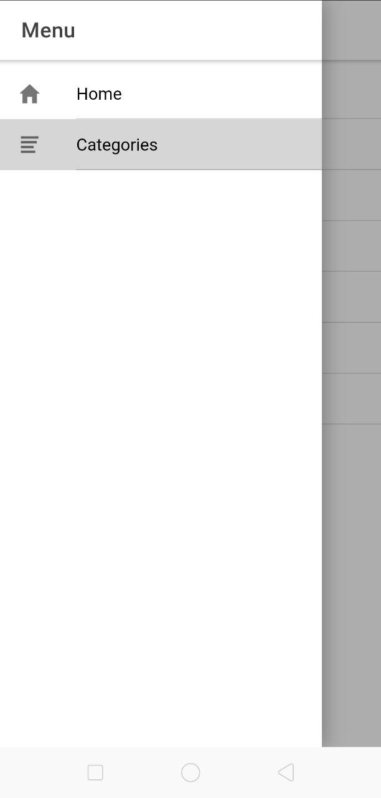
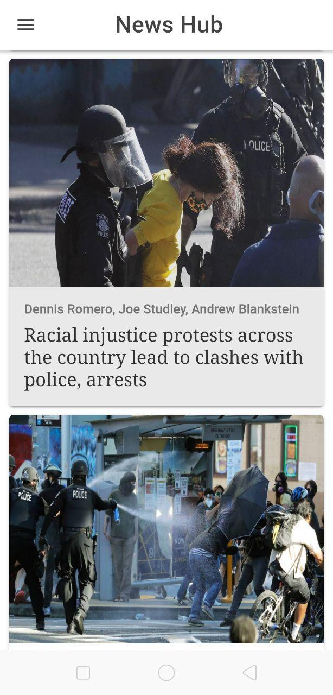
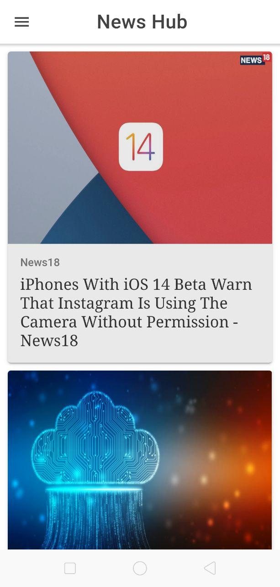

NewsHub

 
**NewsHub is a real time News application which is build using Ionic4 and google api.** 
 
**This is the menu page of my application** 

 
 
**This shows all the different categories of News from which user can select**
 

 
 
**The world News has been set as the default page for my application**
 
**Note : CLICK ON THE NEWS TO READ THE COMPLETE STORY**

 
 
**The below one is sports News**
 

 
 
**This shows technology news** 
 

